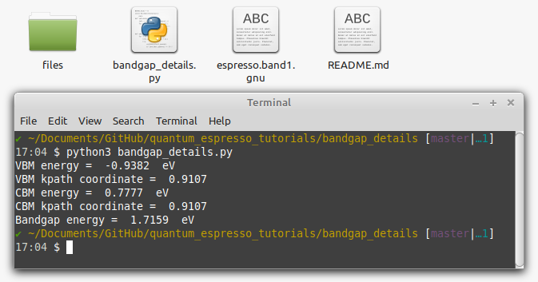

# Extract bandgap details from band gnu output
The script gets the band gnu output of quantum espresso and the number of valence bands and outputs the following details:

* VBM energy
* VBM kpath number and coordinate
* CBM energy
* CBM kpath number and coordinate
* Bandgap energy

Just open the  `bandgap_details.py` file and edit the first two lines. 
```python
bandfile = 'espresso.band1.gnu'
nvbands= 13 # number of valence bands, only for insulators'
```

Now run the code in a terminal


