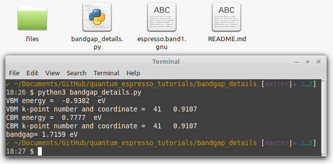

# Extract bandgap details from band gnu output
The script gets the band gnu output of quantum espresso and the Fermi energy and outputs the following details:

* VBM energy
* VBM kpath coordinate
* CBM energy
* CBM kpath coordinate
* Bandgap energy

Just open the  `bandgap_details.py` file and edit the first two lines. Now run the code in a terminal

